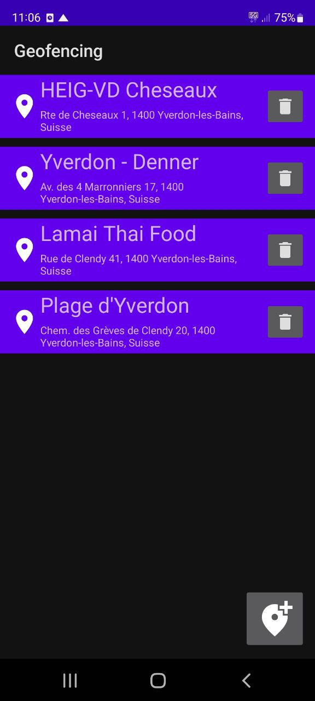
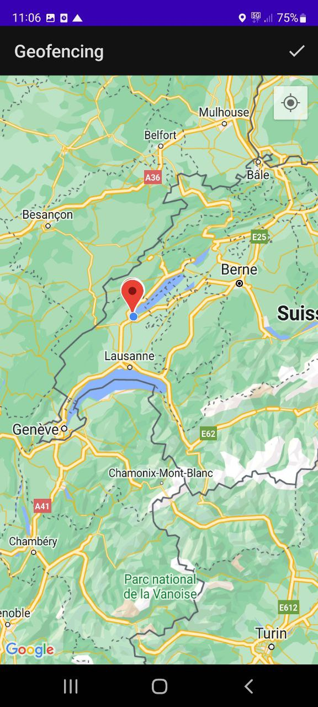
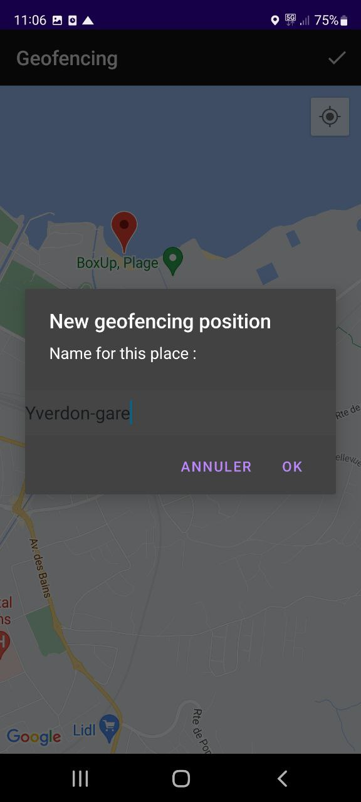
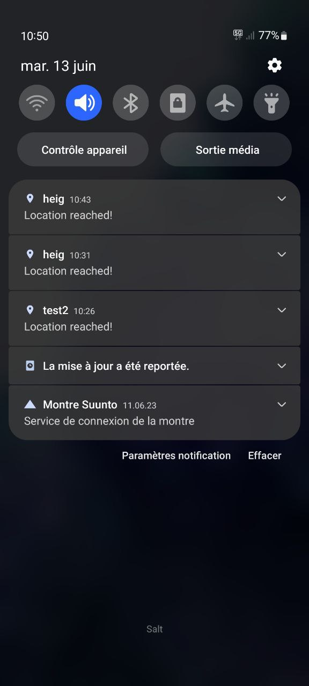

# Application Geofencing pour Android

## Introduction
Ce projet met en service une application Android permettant de définir une position géographique vers laquelle nous seront notifié lorsque le système est proche de cette position. Il s'agit de la technologie geofencing. L'utilisateur choisit une position en sélectionnant un point sur une carte Google Maps et lui attribue un nom. Une page d'acceuil affiche la liste des geofences enregistrés. Une alarme provoquant un son et une vibration, ainsi qu'un message affiché dans la liste des notifications se déclenchent lorsque le smartphone entre dans une zone. Ce message indique que l'utilisateur a atteint le geofence avec le titre correspondant.

## Guide d'utilisation
### Configuration requise
Cette application requiert que le système sur lequel elle s'installe dispose de la géolocalisation.
### Les permissions
Lors de l'ouverture de la page contenant Google Maps pour la première fois, une demande de permission pour l'accès à la position exacte ou approximative est demandée et propose trois choix :
*  Lorsque vous utilisez l'appli
*  Uniquement cette fois-ci
*  Ne pas autoriser  
Pour que l'application fonctionne, il est nécessaire d'appliquer une permission non proposée ici. Celle-ci doit être ajoutée en allant dans les paramètres de l'application (avec un long clique sur l'icone de l'application depuis la page d'application), puis en cliquant sur **information**. Ensuite sous **autorisations**, sélectionner **Position** et **Toujours autoriser**.
Pour que l'application fonctionne avec précision, il est fortement conseillé de permettre un accès **exacte**. 
Si l'utilisateur choisi uniquement **Lorsque vous utiliser l'appli**, il n'y aura pas de notification.

## Utilisation de l'application
La page d'acceuil affiche la liste des geofences ajoutés jusqu'à présent.

 

Il est possible de supprimer un geofence existant avec le boutton corbeille, ou d'en ajouter un en cliquant sur l'icône d'ajout, cette action mène sur une seconde page munie d'une carte Google Maps.  

 

A partir de la carte, il y a une touche en haut à droite pour zoomer sur notre position, celle-ci fonctionne si le GPS est activé.  
En pressant sur la carte, un pop-up apparaît pour ajouter un nouveau geofence, il suffit de lui donner un nom:  

 
  
 
Il sera ensuite ajouté avec un marqueur sur la carte et également listé sur la page d'acceuil.  

## Les notifications
### Comportements
**Ajout d'un geofence sur la localisation actuelle :**  
La notification se déclenche instantanément.  
**Ajout d'un geofence hors de la portée actuelle puis entrée dans la zone en maintenant l'application ouverte:**  
La notification se déclenche instantanément une fois entré dans la zone.    
**Ajout d'un geofence hors de la portée actuelle, fermeture de l'application, verrouillage du smartphone puis entrée dans la zone du geofence:**  
La notificatioin peut se déclencher dans un temps allant d'environ 0 à 20 minutes. Il arrive qu'elle se déclenche instantanément si le smart phone était en utilisation récemment. 
Si le smartphone est resté un certain temps en veille, cela prend en général 10 à 15 minutes pour déclencher l'alarme.  

**Remarques:**  
* En passant dans deux zones geofence l'une après l'autre après que le smartphone soit en veille, il peut arriver que les deux notifications surviennent au même moment lorsqu'on se trouve dans la seconde zone, ou plus tard.
* En ouvrant l'application et la map, si la dernière position calculée était dans une zone, il arrive qu'une notification se déclenche même si l'on est sorti de la zone, en notifiant le geofence de cette dernière position.  

Exemple de notification reçues

  
 

 
## Détail d'implémentation
Le rayon dans lequel est déclenché la notification est de 100 mètres.
Le temps de validité d'une notification et d'une semaine, après ce délai le système supprime notre requête qui avait pour but de nous indiquer l'entrée dans la zone géographique.
Le temps de réaction au plus court pour être notifié par le système est fixé à 1 minute (lorsque l'utilisation n'est pas active).

## Suite de l'implémentation à envisager 
L'application proposée se concentre sur une base simple qui propose deux layouts et les fonctionnalités nécessaires au geofencing. De nombreuses fonctionnalités pourraient être ajoutées afin d'avoir une application plus complète et agréable à l'emploi.  
Quelques fonctionnalités à ajouter:  
* Permettre la modification d'un geofence à partir de la liste en page d'acceuil.
* Permettre la sélection d'un ou plusieurs geofences présents dans la liste en page d'acceuil et pouvoir y apporter des actions comme supprimer la sélection.
* Offrir un layout dédié à un geofence qui présente ses informations tels que son titre, l'adresse fixée, sa durée de validité, etc.
* Lors de la définition du point sur la carte géographique, ajouter un cercle qui montre la zone dans laquelle la notification va être déclenchée.
* Préciser une plage horaire durant laquelle on souhaite que le geofence lance une notification. Ceci permettrait d'éviter de notifier l'utilisateur plusieurs fois dans une journée s'il est amené à faire des aller-retour dans la zone définie alors que la notification peut avoir une importance à un moment précis de la journée.  
* Cette dernière fonctionnalité introduit la notion de tri de la liste des geofences dans l'ordre des alertes de la plus proche à la plus éloignée en temps.  
* Offrir à l'utilisateur le choix du rayon du cercle dans lequel la notification va être déclenchée.
* Ajouter des fonctionnalité à la map comme la recherche d'un lieu.
* Offrir la possibilité de choisir si l'alarme se déclenche une seule fois ou si elle reste activée dans le temps.
* Expliquer à l'utilisateur pourquoi il doit accepter les permissions de localisation.
